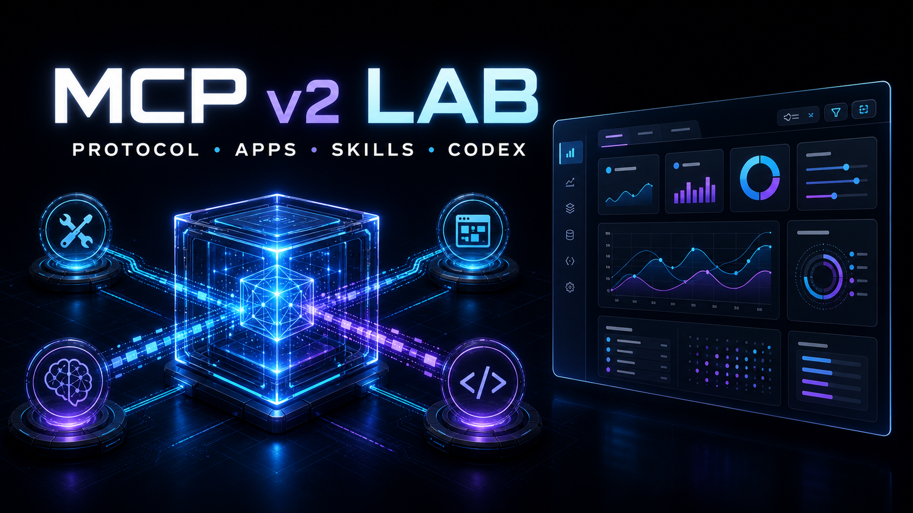

<p align="center">
  
</p>

# MCP v2 实验场

这是个能直接跑起来的 MCP v2 实验仓库。协议、MCP App、Skills 和 Codex
会话被放进同一条验证链路。哪些已经可用，哪些还卡在客户端，都直接写在下面。

## 实验内容

| 实验 | 做法 | 当前结果 |
| --- | --- | --- |
| MCP v2 Server | `@modelcontextprotocol/server@2.0.0`，协议版本 `2026-07-28` | 已通过 |
| Streamable HTTP | modern 使用 JSON；legacy stateless 使用同端点 SSE 响应帧 | 已通过 |
| 旧 Codex 兼容 | v2 内置 `legacy: "stateless"`，不安装 `server-legacy` | Codex CLI `0.145.0` 可调用 |
| Skills | `skills.discover`、`skills.run` | 真实 Codex 会话已通过 |
| MCP App | `ui://` Resource、sandbox、JSON-RPC bridge | Web Host 已通过；Desktop 内嵌 UI 未验收通过 |
| 参数化 Dashboard | `view`、`status`、`query` 驱动 shadcn/ui 界面 | 桌面浏览器与 390px 已通过 |
| Codex 会话验收 | CLI 与当前 Desktop task 直接调用 Tool | 已通过 |
| Prompts | 2 个原生 MCP Prompt，modern 与 legacy 均可发现和渲染 | 通过 |
| Tasks | 5 个应用级 Task Tool，覆盖创建、轮询、列表、取消和结果 | 通过 |
| Auth | 可配置 Bearer Token + scope，覆盖 401/403/授权调用 | 通过 |
| Case Pulse E2E | React Flow 场景地图逐条呈现 modern + legacy 的 25 个用例 | 25/25 |

这里的 legacy SSE 仅指 `2025-06-18` stateless POST 响应的
`text/event-stream` 封装；项目没有旧式独立 SSE endpoint，也没有实现
`subscriptions/listen`。`responseMode: "json"` 只约束 `2026-07-28`
modern 请求，不能据此宣称所有兼容请求都是 JSON 响应。

当前项目定义的八类运行时能力均已实现。Skills 是 Tool 组合出的应用层能力；
Tasks 也采用 `tasks.*` Tool 模型，因为当前 `2026-07-28` SDK 已不提供旧版
原生 Tasks 运行时。Auth 在设置 `MCP_AUTH_TOKEN` 后启用；未设置时保留本地
免鉴权开发模式。

## 场景化验证中心

验证中心不再提供“总览”和“全链路验收”入口，而是直接进入五个独立现场：
协议、工具、技能、MCP 应用和 Codex 会话。顶部状态栏持续显示服务状态、
协议版本和当前场景编号；自动化 25 个用例仍由服务端门禁执行。

`orders.dashboard` 是这里最直观的实验。它返回一个 React + shadcn/ui
Dashboard，组件里的 Tabs 和 Select 会再次调用 Tool，拿到新的
`structuredContent` 后切换视图。

```json
{
  "view": "orders",
  "status": "paid"
}
```

这组参数会返回一条演示订单 `ord_demo_1001`。Codex CLI 能拿到结果；
当前 Codex Desktop 还没有把 MCP App 真正渲染到会话里。仓库里的 Web Host
已经跑通完整界面链路，但两者不能混为一谈。

## 运行

```bash
bun install
bun run dev
```

- 验证中心：<http://localhost:3000/>
- MCP Server：<http://localhost:3001/mcp>

完整验收：

```bash
bun run acceptance
```

它会执行 TypeScript 7 类型检查、Bun 测试、Rsbuild 构建、HTTP
验收、Playwright 桌面与移动端验收，以及面向 Codex 的客户端调用链。

## 目录

```text
apps/mcp-app   shadcn/ui MCP App，构建为单文件 HTML
apps/web       React Flow 逐用例验证中心与 MCP App Host
services/mcp   Bun MCP Server、Tool、Resource 和验收脚本
packages/shared
               共享契约与测试夹具
```

详细结果见 [验证报告](./docs/verification-report.md)。本轮用例范围和完成边界
记录在 [E2E 验收规划](./docs/e2e-acceptance-plan.md)。
